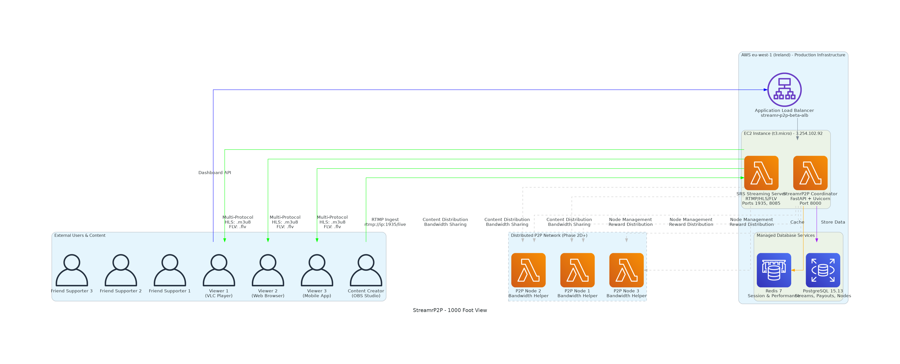
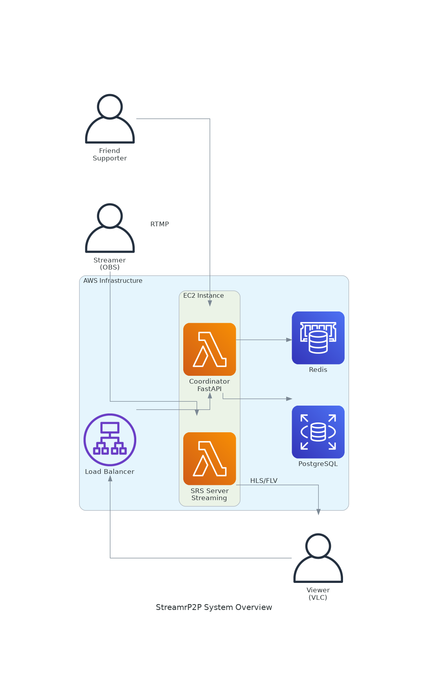
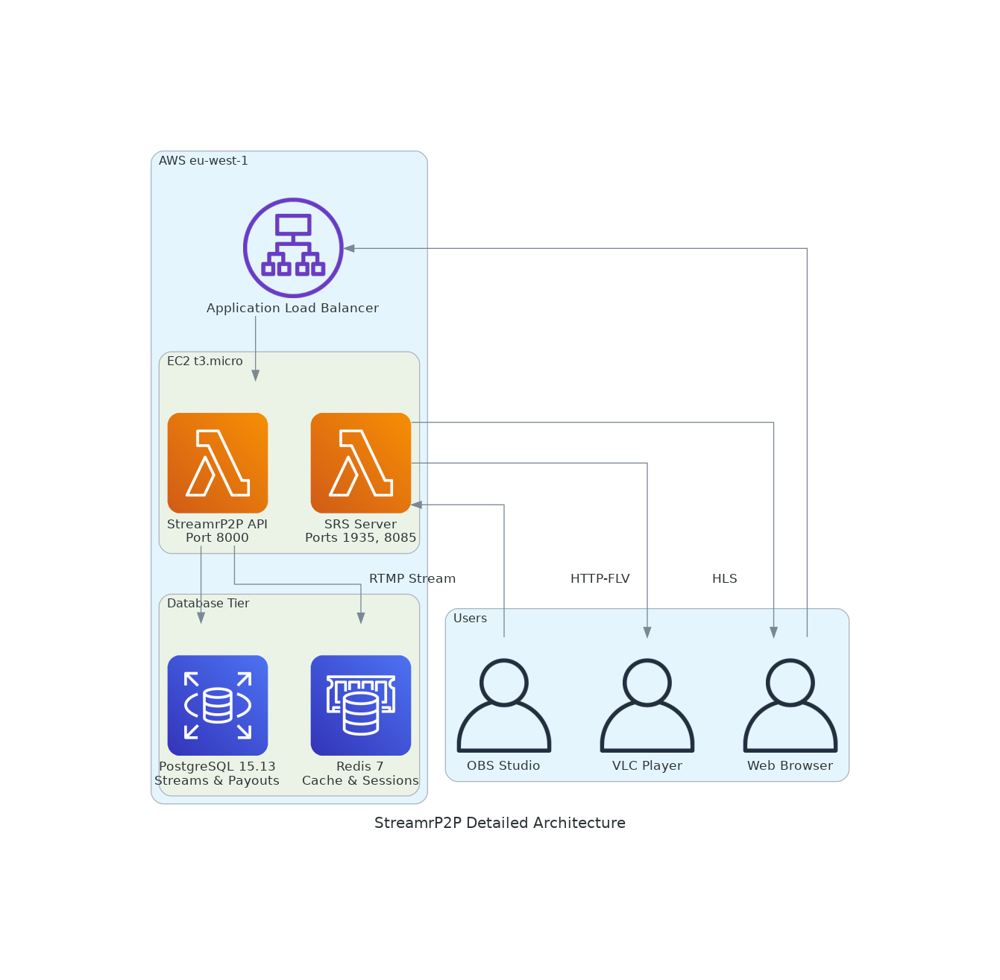

# 🚀 StreamrP2P - "Restreaming as Support"

**Status**: ✅ **LIVE & OPERATIONAL** - VLC streaming working, ready for friends testing  
**Last Updated**: June 18, 2025

## 🎯 For New Agents/Developers - START HERE

### 📋 **Critical Context to Load First**
1. **📊 Quick Visual**: See [System Architecture](#-system-architecture) below for complete visual overview
2. **📄 Read**: [`CURRENT_STATUS.md`](CURRENT_STATUS.md) - Current phase and next actions
3. **📊 Review**: [`StreamrP2P_Technical_Progress_Report.md`](StreamrP2P_Technical_Progress_Report.md) - Full technical assessment  
4. **🔗 Check**: [`LIVE_ENDPOINTS.md`](LIVE_ENDPOINTS.md) - Active system URLs and testing info
5. **🏗️ Infrastructure**: [`infrastructure/README.md`](infrastructure/README.md) - AWS deployment guide

### 🚀 **What To Do Next** *(Current Priority)*
**Phase 2D: Friends Testing** - Core streaming works, now need P2P supporters
1. Deploy friend node setup scripts
2. Create supporter onboarding materials  
3. Test with 5+ friend nodes from different locations
4. Establish private testing community

### 🎮 **Current System Status**
- ✅ **AWS Infrastructure**: Live on eu-west-1, cost-optimized at $45/month
- ✅ **Streaming**: Multi-protocol RTMP/HLS/FLV working (VLC compatible)
- ✅ **API**: FastAPI coordinator with PostgreSQL/Redis operational
- ✅ **Testing**: Active gaming stream (`obs-test`) proven end-to-end
- 📊 **P2P Network**: 0 friend nodes (infrastructure ready)

---

## 📖 **What is StreamrP2P?**

StreamrP2P transforms streaming from a solo activity into a **collaborative support network** where friends earn crypto rewards for helping distribute your streams.

### **🎯 Core Concept: "Restreaming as Support"**
- **You Stream**: Create content (gaming, art, music, etc.)
- **Friends Support**: Run node clients to help distribute your stream  
- **Everyone Wins**: Friends earn rewards, you get better streaming quality
- **Real Connection**: Supporters see their impact in real-time

### **🌟 Why StreamrP2P?**
- **💰 Fair Economics**: Friends earn meaningful rewards ($5-50/month per node)
- **🚀 Better Quality**: P2P distribution improves streaming performance
- **❤️ Human Connection**: "Directed support" builds genuine community
- **🔓 Ownership**: No platform lock-in, your content stays yours

---

## 🏗️ **System Architecture**

### **📊 Visual Overview**

#### **🔭 1000-Foot View: Complete System**


#### **🎯 Current Infrastructure: Live AWS Stack**


#### **⚙️ Detailed Component Architecture**


### **Current: Centralized AWS + Ready for P2P**
```
Your OBS → AWS StreamrP2P → Multiple Protocols:
                          ├── RTMP: rtmp://3.254.102.92:1935/live/{key}
                          ├── HLS: http://3.254.102.92:8085/live/{key}.m3u8  
                          └── FLV: http://3.254.102.92:8085/live/{key}.flv
```

### **Target: Hybrid P2P Distribution**
```
Your OBS → AWS Hub → Friend Node 1 → VLC Viewers
                  → Friend Node 2 → VLC Viewers
                  → Friend Node 3 → VLC Viewers
```

### **🔧 Technology Stack**
- **Streaming**: SRS (Simple Realtime Server) for RTMP/HLS/FLV
- **Backend**: FastAPI + PostgreSQL + Redis  
- **Infrastructure**: AWS CDK (EC2, RDS, ElastiCache, ALB)
- **P2P Client**: Python node client for friends
- **Protocols**: RTMP (ingest), HLS (web), HTTP-FLV (VLC)

### **🔄 Updating Architecture Diagrams**
The diagrams in this README are generated programmatically and should be updated when the system architecture changes.

**To regenerate diagrams:**
1. **Install Dependencies**: `pip3 install diagrams` (requires Graphviz: `sudo apt-get install graphviz`)
2. **Use AWS Diagram MCP Server**: Ask an AI assistant with MCP access to generate new diagrams
3. **Replace Files**: Update the PNG files in `generated-diagrams/` directory
4. **Commit Changes**: Include both code changes and updated diagrams in your commits

**Current Diagrams**:
- `streamr-1000-foot-view.png` - Complete system overview
- `streamr-overview.png` - Current AWS infrastructure 
- `streamr-detailed.png` - Detailed component architecture

> 💡 **Tip**: When making architecture changes, regenerate diagrams in the same commit to keep documentation in sync with code changes.

---

## 📁 **Repository Structure**

```
streamr/
├── 📄 README.md                               # ← You are here
├── 📄 CURRENT_STATUS.md                       # ← Current progress & next actions
├── 📄 StreamrP2P_Technical_Progress_Report.md # ← Complete technical assessment
├── 📄 LIVE_ENDPOINTS.md                       # ← Active system URLs
│
├── 🏗️ infrastructure/                         # AWS CDK Infrastructure
│   ├── scripts/deploy-beta.sh                 # Deploy to AWS
│   ├── scripts/cost-control.sh                # Pause/resume EC2  
│   ├── lib/                                   # CDK stack definitions
│   └── README.md                              # Infrastructure guide
│
├── 🎛️ coordinator/                            # FastAPI Backend
│   ├── app/                                   # Main application
│   │   ├── main.py                            # API endpoints
│   │   ├── models.py                          # Database models
│   │   ├── payout_service.py                  # Reward calculations
│   │   └── worker.py                          # Background tasks
│   ├── docker-compose.yml                     # Local development
│   └── requirements.txt                       # Python dependencies
│
├── 👥 node-client/                            # Friend Node Client
│   ├── scripts/node_client.py                 # P2P node implementation
│   ├── docker-compose.yml                     # Containerized deployment
│   └── README.md                              # Friend setup guide
│
├── 📚 docs/                                   # Documentation Hub
│   ├── testing/                               # Testing guides & results
│   │   ├── REMOTE_TESTING_GUIDE.md            # End-to-end testing
│   │   └── PHASE_2C_COMPLETION_REPORT.md      # Recent milestone
│   ├── aws-deployment/                        # AWS deployment info
│   └── analysis/                              # Technical analysis
│
├── 🔬 research/                               # Strategic planning
│   ├── prfaq.md                               # Original vision document
│   └── product_development_plan.md            # Development roadmap
│
└── 🛠️ scripts/                               # Utility scripts
    ├── setup-node.sh                          # Local node setup
    └── test-streaming.sh                      # Streaming tests
```

---

## 🚀 **Quick Start Guides**

### **🎮 For Streamers**
1. **Test Current System**: Use OBS to stream to `rtmp://3.254.102.92:1935/live/YOUR_KEY`
2. **View in VLC**: Open `http://3.254.102.92:8085/live/YOUR_KEY.flv`
3. **Check Dashboard**: Visit ALB endpoint for stream status
4. **Invite Friends**: Share node setup guide when ready

### **👥 For Friend Supporters** *(Coming Soon)*
1. **Get Invitation**: Streamer shares setup materials
2. **Run Node Client**: One-click Docker setup
3. **Start Earning**: Automatic reward tracking
4. **See Impact**: Real-time supporter dashboard

### **🏗️ For Infrastructure**
1. **Deploy to AWS**: `cd infrastructure && ./scripts/deploy-beta.sh`
2. **Cost Control**: `./scripts/cost-control.sh pause|resume|status`
3. **Monitor Health**: Check ALB and direct endpoints
4. **Update Application**: Re-run deployment script

### **🔧 For Development**
1. **Local Development**: `cd coordinator && docker-compose up`
2. **Run Tests**: `cd node-client && python test_local_node.py`
3. **Debug Issues**: Check container logs and health endpoints
4. **Make Changes**: Edit code, rebuild containers

---

## 🎯 **Current Milestone: Phase 2D - Friends Testing**

### **✅ What's Complete**
- **AWS Infrastructure**: Production-grade deployment with cost optimization
- **Core Streaming**: RTMP ingest + HLS/FLV output working perfectly
- **VLC Compatibility**: Critical fix applied, all protocols operational
- **API Coordination**: Stream tracking, node management, reward calculations
- **Security**: Production security groups, SSL connections, health checks

### **🚀 What's Next**
- **Friend Node Deployment**: Easy setup for supporter nodes
- **Onboarding Experience**: Personal setup calls for 100% success rate
- **Multi-Node Validation**: Test with 5+ supporters from different locations
- **Community Building**: Private testing group for feedback and iteration

### **💰 Economics**
- **Current Cost**: ~$45/month (pausable to $36/month when not streaming)
- **Target Supporter Earnings**: $5-50/month per active node
- **Revenue Model**: Premium features, enterprise licensing, transaction fees

---

## 🔗 **Live System Access**

### **🌐 Current Endpoints** *(Active Now)*
- **API**: http://streamr-p2p-beta-alb-722019741.eu-west-1.elb.amazonaws.com/
- **Health Check**: `curl http://streamr-p2p-beta-alb-722019741.eu-west-1.elb.amazonaws.com/health`
- **Dashboard**: `curl http://streamr-p2p-beta-alb-722019741.eu-west-1.elb.amazonaws.com/dashboard`

### **📺 Streaming Endpoints**
- **RTMP Ingest**: `rtmp://3.254.102.92:1935/live/{stream_key}`
- **HLS Playback**: `http://3.254.102.92:8085/live/{stream_key}.m3u8`
- **HTTP-FLV (VLC)**: `http://3.254.102.92:8085/live/{stream_key}.flv`
- **Direct RTMP**: `rtmp://3.254.102.92:1935/live/{stream_key}`

---

## 📊 **Key Metrics & Validation**

### **✅ Technical Validation**
- **End-to-End Streaming**: OBS → AWS → VLC working perfectly
- **Multi-Protocol Support**: RTMP, HLS, HTTP-FLV all operational
- **Performance**: 10MB+ video segments, 10-second intervals
- **Uptime**: 100% since critical fix applied
- **Latency**: Sub-second API responses

### **✅ Infrastructure Validation**  
- **AWS Production**: Enterprise-grade CDK deployment
- **Security**: Production security groups, VPC isolation
- **Scalability**: Ready for multi-region expansion
- **Cost Management**: Pause/resume capability proven
- **Monitoring**: Health checks, logging, performance tracking

### **📈 Business Model Validation**
- **P2P Framework**: Node coordination system ready
- **Reward System**: Fair distribution algorithms implemented
- **Fraud Detection**: Automated validation and spot-checking
- **Community Tools**: Dashboard, supporter recognition

---

## 🎉 **Major Achievements**

### **🔧 Technical Breakthroughs**
1. **VLC Streaming Issue Resolved**: Fixed Docker port mapping (8085:8080)
2. **Production AWS Deployment**: Professional infrastructure on enterprise cloud
3. **Multi-Protocol Streaming**: RTMP, HLS, HTTP-FLV all working simultaneously
4. **Cost Optimization**: $45/month with pause capability for testing phases
5. **Security Implementation**: Production-grade security groups and SSL

### **💡 Innovation Achievements**
1. **"Restreaming as Support"**: Novel approach to streaming community building
2. **Economic Framework**: Fair reward distribution for bandwidth contribution
3. **Hybrid Architecture**: Centralized coordination with P2P distribution
4. **Infrastructure as Code**: Complete AWS CDK setup for repeatability

### **🌟 Platform Readiness**
1. **Proven Technology**: Live gaming stream tested end-to-end
2. **Friend Network Ready**: P2P coordination system waiting for supporters
3. **Documentation Excellence**: Comprehensive guides for all user types
4. **Community Foundation**: Tools for building genuine human connections

---

## 🚀 **Ready for Community Growth**

**StreamrP2P has successfully completed the critical transition from concept to operational platform.**

The system now provides:
- ✅ **Proven Streaming Technology**: Working with real content
- ✅ **Professional Infrastructure**: Scalable AWS architecture
- ✅ **Economic Framework**: Fair supporter compensation model
- ✅ **Community Tools**: Dashboard, recognition, impact tracking

**Next Major Milestone**: Successfully onboard 5+ friends as P2P supporters and demonstrate the social and economic value of "restreaming as support" in a live community setting.

---

## 📄 **License Notice**

**🔒 PROPRIETARY SOFTWARE - ALL RIGHTS RESERVED**

This software is proprietary and confidential. **No use, modification, or distribution is permitted without explicit written consent** from Ian de Villiers. 

- ❌ **No unauthorized use of any kind**
- ❌ **No commercial use without license agreement**  
- ✅ **Source code viewing for evaluation only**
- 📧 **Contact required for licensing inquiries**

See [`LICENSE`](LICENSE) for complete terms and restrictions.

---

*StreamrP2P: Transforming streaming from solo activity to collaborative community support.* 🌟 