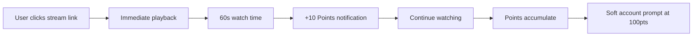

# 🎯 StreamrP2P User Journey Analysis & Technical Implementation Guide

> **Version**: 1.0  
> **Date**: January 2025  
> **Status**: Implementation Ready  
> **Based on**: Competitive analysis (Theta Network, DLive) + ZEN Advisor consultations

## 📋 Executive Summary

This document outlines the optimal user journey strategy for StreamrP2P based on extensive competitive research and expert consultations. The key breakthrough is implementing an **"Engagement-First"** model that builds community loyalty before requesting technical commitment, avoiding the tokenomics failures that destroyed Theta Network (-95% token value) and DLive (discontinued BTT staking).

**Core Strategy**: Fiat-first rewards + Social engagement layer + Hybrid P2P architecture

---

## 🎭 User Persona Deep Dive

### 1. **The Viewer** (Primary Entry Point - 90% of users)
```yaml
Motivation: Seamless streaming experience
Pain Points: 
  - Platform censorship
  - Ads interrupting content
  - No rewards for engagement
Journey: Discovery → Passive Viewing → Engaged Viewing
Conversion Goal: Account creation + loyalty point accumulation
```

### 2. **The Supporter** (Revenue Engine - 5-10% of users)
```yaml
Sub-Personas:
  Superfan:
    Motivation: Help specific creators
    Reward Sensitivity: Low (social status > money)
    Churn Risk: Low if social features work
  
  Speculator:
    Motivation: Financial ROI
    Reward Sensitivity: High
    Churn Risk: High if earnings < electricity costs

Journey: Engaged Viewer → Node Installation → Active Supporting
Technical Requirements: Desktop app, bandwidth sharing
```

### 3. **The Streamer** (Content Magnet - <1% of users)
```yaml
Motivation: 
  - Lower platform fees (15% vs YouTube's 30%)
  - Censorship resistance
  - Direct community monetization
Pain Points:
  - Platform deplatforming risk
  - High CDN costs
  - Lack of viewer engagement tools
Journey: Research → Onboarding → Community Building → Retention
```

---

## 🚀 Optimal User Journey Architecture

### **Phase 1: Viewer → Engaged Viewer (The Hook)**

#### Landing Experience Flow


#### Technical Implementation
```javascript
// Loyalty Points System - Backend API
POST /api/viewers/points
{
  "viewer_id": "anonymous_uuid_or_user_id",
  "stream_id": "stream_123",
  "action": "watch_time",
  "duration_seconds": 60,
  "timestamp": "2025-01-15T10:30:00Z"
}

// Points Calculation Logic
const POINT_RATES = {
  watch_time: 1, // 1 point per minute
  chat_message: 5,
  follow_streamer: 25,
  share_stream: 50
};
```

#### Database Schema
```sql
-- Loyalty Points System
CREATE TABLE viewer_points (
    id UUID PRIMARY KEY,
    viewer_id UUID NOT NULL,
    stream_id UUID NOT NULL,
    action_type VARCHAR(50) NOT NULL,
    points_earned INTEGER NOT NULL,
    created_at TIMESTAMP DEFAULT NOW(),
    INDEX idx_viewer_points (viewer_id, created_at)
);

CREATE TABLE point_balances (
    viewer_id UUID PRIMARY KEY,
    total_points INTEGER DEFAULT 0,
    available_points INTEGER DEFAULT 0,
    last_updated TIMESTAMP DEFAULT NOW()
);
```

### **Phase 2: Engaged Viewer → Supporter (The Upgrade)**

#### Conversion Trigger Events
```yaml
High-Intent Moments:
  - User attempts to donate to streamer
  - User views their points balance
  - Favorite streamer goes live
  - User reaches "VIP Viewer" status (1000+ points)

Conversion UI:
  CTA: "Supercharge your support and earn real cash!"
  Value Prop: "5x points multiplier + $2-5/month earnings"
  Social Proof: "Join 347 other supporters helping this channel"
```

#### Supporter Node Technical Architecture
```python
# Supporter Node Client - Main Application
class SupporterNode:
    def __init__(self, config):
        self.bandwidth_limiter = BandwidthLimiter(config.max_upload_mbps)
        self.p2p_client = LibP2PClient()
        self.coordinator_api = CoordinatorAPI()
        self.metrics_collector = MetricsCollector()
    
    def start_supporting(self, stream_id):
        # Register with coordinator
        peer_info = self.coordinator_api.register_supporter(
            stream_id=stream_id,
            node_id=self.node_id,
            capabilities=self.get_capabilities()
        )
        
        # Join P2P swarm
        self.p2p_client.join_swarm(peer_info.swarm_hash)
        
        # Start serving content
        self.start_chunk_serving()
```

#### Quality of Service (QoS) Measurement
```python
# QoS Metrics Collection
class QoSCollector:
    def measure_delivery_quality(self, chunk_delivery):
        return {
            "latency_ms": chunk_delivery.end_time - chunk_delivery.start_time,
            "success_rate": chunk_delivery.successful_chunks / chunk_delivery.total_chunks,
            "peer_distance": self.calculate_geographic_distance(chunk_delivery.peer),
            "bandwidth_efficiency": chunk_delivery.bytes_served / chunk_delivery.connection_time
        }
    
    def calculate_reputation_score(self, historical_metrics):
        weights = {
            "uptime": 0.3,
            "latency": 0.25,
            "success_rate": 0.25,
            "geographic_diversity": 0.2
        }
        return sum(metric * weights[key] for key, metric in historical_metrics.items())
```

### **Phase 3: Streamer Onboarding & Retention**

#### Genesis Node System (Hybrid CDN)
```yaml
Architecture:
  - Platform-operated "Genesis Nodes" provide CDN fallback
  - New streamers get 50GB/month free CDN bandwidth
  - P2P network augments (doesn't replace) reliability
  - Automatic failover when P2P quality degrades

Implementation:
  Genesis Nodes: AWS EC2 instances running supporter client
  Monitoring: CloudWatch alerts for P2P vs CDN ratio
  Cost Control: Automatic scaling based on demand
```

#### Streamer Dashboard - Real-time Analytics
```javascript
// Streamer Dashboard API Endpoints
GET /api/streamers/{id}/supporter-analytics
{
  "current_supporters": 45,
  "total_bandwidth_saved": "2.3 GB today",
  "estimated_cost_savings": "$12.50 this month",
  "p2p_vs_cdn_ratio": "78% P2P, 22% CDN",
  "top_supporters": [
    {
      "name": "SupporterUsername",
      "data_served": "340 MB",
      "uptime": "95%",
      "loyalty_points": 2500
    }
  ]
}
```

---

## 💰 Economic Model & Revenue Distribution

### **Sustainable Revenue Sharing Formula**

```python
# Revenue Distribution Algorithm
def calculate_payouts(stream_revenue, p2p_metrics):
    # Step 1: Platform commission
    platform_fee = stream_revenue * 0.15  # 15% base rate
    
    # Step 2: P2P savings calculation
    cdn_cost_saved = p2p_metrics.gb_served * 0.05  # $0.05/GB standard CDN rate
    p2p_rebate = cdn_cost_saved * 0.5  # Share 50% of savings
    
    # Step 3: Supporter pool allocation
    supporter_pool = (stream_revenue - platform_fee) * 0.20 + p2p_rebate
    
    # Step 4: Distribute to supporters based on contribution
    supporter_payouts = distribute_by_contribution(supporter_pool, p2p_metrics.supporters)
    
    # Step 5: Streamer receives remainder
    streamer_payout = stream_revenue - platform_fee - supporter_pool
    
    return {
        "platform": platform_fee,
        "streamer": streamer_payout,
        "supporters": supporter_payouts,
        "total_distributed": sum(supporter_payouts.values())
    }
```

### **Proof-of-Useful-Work System**

```python
# Cryptographic Verification for Chunk Delivery
class ProofOfWork:
    def generate_chunk_challenge(self, stream_id, segment_id):
        """Coordinator generates random challenges to verify supporters have data"""
        merkle_root = self.get_segment_merkle_root(stream_id, segment_id)
        random_chunk_index = random.randint(0, self.get_chunk_count(segment_id))
        
        return {
            "challenge_id": uuid4(),
            "stream_id": stream_id,
            "segment_id": segment_id,
            "chunk_index": random_chunk_index,
            "expected_merkle_root": merkle_root,
            "expires_at": datetime.now() + timedelta(minutes=5)
        }
    
    def verify_challenge_response(self, challenge, response):
        """Verify supporter actually has the requested chunk"""
        reconstructed_root = self.reconstruct_merkle_root(
            response.chunk_hash,
            response.sibling_hashes,
            challenge.chunk_index
        )
        
        return reconstructed_root == challenge.expected_merkle_root

# Supporter rewards calculation
def calculate_supporter_earnings(supporter_id, time_period):
    metrics = get_supporter_metrics(supporter_id, time_period)
    
    base_earnings = metrics.chunks_delivered * RATE_PER_CHUNK
    uptime_bonus = metrics.uptime_percentage * UPTIME_MULTIPLIER
    qos_multiplier = calculate_qos_score(metrics.latency_avg, metrics.success_rate)
    
    return base_earnings * (1 + uptime_bonus) * qos_multiplier
```

---

## 🛠 Technical Architecture Deep Dive

### **Core Infrastructure Stack**

```yaml
Production Infrastructure:
  Cloud Provider: AWS
  Container Orchestration: Docker + ECS
  Load Balancer: Application Load Balancer (ALB)
  
Backend Services:
  API Framework: FastAPI (Python)
  Database: PostgreSQL 14+ with read replicas
  Cache: Redis (AWS ElastiCache)
  Message Queue: AWS SQS + Kinesis for high-volume events
  
Time-Series Analytics:
  Primary: TimescaleDB (PostgreSQL extension)
  Alternative: AWS Timestream
  Use Case: Real-time supporter earnings, QoS metrics
  
Video Infrastructure:
  RTMP Ingestion: SRS (Simple Realtime Server)
  CDN Fallback: AWS CloudFront
  Streaming Protocol: HLS with chunked delivery
```

### **P2P Networking Implementation**

```python
# LibP2P-based Supporter Client
from libp2p import new_node
from libp2p.stream_muxer import mplex
from libp2p.security import secio

class P2PVideoRelay:
    def __init__(self):
        self.node = new_node(
            muxer=mplex.Mplex(),
            sec=secio.SecIO()
        )
        self.chunk_store = LRUCache(maxsize=1000)  # Cache recent video chunks
    
    async def join_streaming_swarm(self, stream_id):
        # Discover peers through Coordinator API
        peers = await self.coordinator.get_swarm_peers(stream_id)
        
        # Connect to high-reputation peers
        for peer in sorted(peers, key=lambda p: p.reputation_score, reverse=True)[:10]:
            await self.node.dial(peer.multiaddr)
    
    async def serve_video_chunk(self, chunk_request):
        """Serve video chunk to requesting peer"""
        if chunk_request.chunk_id in self.chunk_store:
            # Serve from local cache
            chunk_data = self.chunk_store[chunk_request.chunk_id]
        else:
            # Fetch from upstream peer or CDN
            chunk_data = await self.fetch_chunk_upstream(chunk_request.chunk_id)
            self.chunk_store[chunk_request.chunk_id] = chunk_data
        
        # Track delivery metrics for rewards
        await self.report_chunk_delivery(chunk_request.peer_id, chunk_request.chunk_id)
        
        return chunk_data

# Bandwidth Management
class BandwidthLimiter:
    def __init__(self, max_upload_mbps=5, max_download_mbps=10):
        self.upload_bucket = TokenBucket(capacity=max_upload_mbps * 1024 * 1024)
        self.download_bucket = TokenBucket(capacity=max_download_mbps * 1024 * 1024)
    
    def check_metered_connection(self):
        """Detect if user is on metered connection (mobile data, etc.)"""
        if platform.system() == "Windows":
            # Use Windows API to check connection profile
            return self._windows_is_metered()
        elif platform.system() == "Darwin":
            # macOS network interface check
            return self._macos_is_metered()
        else:
            # Linux - check via NetworkManager
            return self._linux_is_metered()
```

### **Real-Time Analytics Pipeline**

```python
# High-Volume Event Processing
class EventIngestionPipeline:
    def __init__(self):
        self.kinesis_client = boto3.client('kinesis')
        self.stream_name = 'streamr-p2p-events'
    
    async def ingest_viewer_event(self, event):
        """Handle viewer engagement events (watch time, chat, etc.)"""
        event_data = {
            "event_type": event.type,
            "viewer_id": event.viewer_id,
            "stream_id": event.stream_id,
            "timestamp": event.timestamp.isoformat(),
            "metadata": event.metadata
        }
        
        await self.kinesis_client.put_record(
            StreamName=self.stream_name,
            Data=json.dumps(event_data),
            PartitionKey=event.stream_id
        )
    
    async def ingest_p2p_metrics(self, metrics):
        """Handle P2P delivery metrics for supporter rewards"""
        metrics_data = {
            "event_type": "p2p_delivery",
            "supporter_id": metrics.supporter_id,
            "stream_id": metrics.stream_id,
            "chunks_delivered": metrics.chunks_delivered,
            "total_bytes": metrics.total_bytes,
            "average_latency": metrics.average_latency,
            "timestamp": metrics.timestamp.isoformat()
        }
        
        await self.kinesis_client.put_record(
            StreamName=self.stream_name,
            Data=json.dumps(metrics_data),
            PartitionKey=metrics.supporter_id
        )

# Real-time Aggregation Worker
class MetricsAggregator:
    def __init__(self):
        self.redis_client = redis.Redis()
        self.postgres_client = asyncpg.create_pool()
    
    async def process_event_batch(self, events):
        """Process batch of events and update real-time metrics"""
        for event in events:
            if event["event_type"] == "viewer_points":
                await self.update_points_balance(event)
            elif event["event_type"] == "p2p_delivery":
                await self.update_supporter_earnings(event)
    
    async def update_supporter_earnings(self, event):
        """Update supporter earnings in real-time"""
        earnings_key = f"earnings:{event['supporter_id']}:{datetime.now().strftime('%Y-%m-%d')}"
        
        # Update Redis for real-time dashboard
        pipe = self.redis_client.pipeline()
        pipe.hincrby(earnings_key, "total_bytes", event["total_bytes"])
        pipe.hincrby(earnings_key, "chunks_delivered", event["chunks_delivered"])
        pipe.hset(earnings_key, "last_updated", time.time())
        pipe.expire(earnings_key, 86400 * 7)  # Keep for 7 days
        pipe.execute()
        
        # Update PostgreSQL for permanent records (batched)
        await self.batch_update_postgres(event)
```

---

## 🎮 Social Features & Community Engagement

### **Support Squads System**

```python
# Community Features Implementation
class SupportSquad:
    def __init__(self, squad_id, streamer_id):
        self.squad_id = squad_id
        self.streamer_id = streamer_id
        self.members = []
        self.collective_stats = {}
    
    def add_member(self, supporter_id):
        """Add supporter to squad with social proof"""
        self.members.append(supporter_id)
        
        # Trigger social notifications
        self.notify_streamer(f"New squad member: {supporter_id}")
        self.notify_squad_members(f"{supporter_id} joined your support squad!")
    
    def calculate_squad_impact(self):
        """Calculate collective contribution for leaderboards"""
        return {
            "total_data_served": sum(member.bytes_served for member in self.members),
            "average_uptime": mean(member.uptime_percentage for member in self.members),
            "cost_savings_generated": sum(member.cost_savings for member in self.members),
            "collective_points": sum(member.loyalty_points for member in self.members)
        }

# Gamification & Social Proof
class SocialProofEngine:
    def generate_chat_notifications(self, event):
        """Generate social proof messages for chat"""
        if event.type == "new_supporter":
            return f"🎉 {event.username} is now helping power this stream! Welcome to the squad!"
        elif event.type == "supporter_milestone":
            return f"⚡ {event.username} just hit {event.milestone} GB served! Legend!"
        elif event.type == "cost_savings_goal":
            return f"💰 Community goal reached! We've saved the streamer ${event.amount} this month!"

# Real-time Leaderboards
async def get_supporter_leaderboard(stream_id, time_period="daily"):
    """Generate supporter leaderboard for social engagement"""
    query = """
    SELECT 
        s.username,
        s.supporter_id,
        SUM(m.bytes_served) as total_bytes,
        AVG(m.uptime_percentage) as avg_uptime,
        SUM(m.earnings) as total_earnings,
        COUNT(m.chunks_delivered) as total_chunks
    FROM supporters s
    JOIN supporter_metrics m ON s.supporter_id = m.supporter_id
    WHERE s.stream_id = $1 
      AND m.recorded_at >= NOW() - INTERVAL '1 DAY'
    GROUP BY s.supporter_id, s.username
    ORDER BY total_bytes DESC
    LIMIT 10
    """
    
    return await postgres_pool.fetch(query, stream_id)
```

### **Word-of-Mouth Growth Mechanisms**

```python
# Referral System Implementation
class ReferralEngine:
    REFERRAL_REWARDS = {
        "viewer_refers_viewer": {"referrer": 500, "referee": 500},  # Loyalty points
        "supporter_refers_supporter": {"cash_bonus_days": 30, "percentage_boost": 0.1},
        "viewer_refers_streamer": {"lifetime_percentage": 0.01}  # 1% of streamer revenue for life
    }
    
    def process_successful_referral(self, referrer_id, referee_id, referral_type):
        """Handle successful referral completion"""
        rewards = self.REFERRAL_REWARDS[referral_type]
        
        if referral_type == "viewer_refers_viewer":
            # Award loyalty points to both parties
            await self.award_points(referrer_id, rewards["referrer"])
            await self.award_points(referee_id, rewards["referee"])
            
        elif referral_type == "supporter_refers_supporter":
            # Boost supporter earnings for 30 days
            await self.create_earnings_boost(referrer_id, rewards)
            await self.create_earnings_boost(referee_id, rewards)
            
        elif referral_type == "viewer_refers_streamer":
            # Create lifetime revenue share
            await self.create_lifetime_revenue_share(referrer_id, referee_id, rewards["lifetime_percentage"])

# Viral Growth Analytics
def track_viral_coefficients():
    """Measure word-of-mouth effectiveness"""
    return {
        "viral_coefficient": successful_referrals / total_users,
        "referral_conversion_rate": successful_conversions / referral_clicks,
        "time_to_conversion": avg_time_between_referral_and_signup,
        "ltv_boost_from_referrals": avg_ltv_referred_vs_organic
    }
```

---

## 🚨 Risk Mitigation & Security

### **Anti-Fraud & Sybil Resistance**

```python
# Multi-layered Anti-Fraud System
class FraudDetection:
    def __init__(self):
        self.reputation_threshold = 0.7
        self.max_nodes_per_ip = 3
        self.min_stake_amount = 10.00  # USD
    
    async def validate_new_supporter(self, supporter_data):
        """Comprehensive validation for new supporter nodes"""
        checks = {
            "ip_address_limit": await self.check_ip_address_limit(supporter_data.ip),
            "stake_verification": await self.verify_stripe_stake(supporter_data.stripe_payment_id),
            "device_fingerprint": await self.analyze_device_fingerprint(supporter_data.device_info),
            "behavioral_analysis": await self.analyze_signup_behavior(supporter_data)
        }
        
        if all(checks.values()):
            return {"approved": True, "initial_reputation": 0.1}
        else:
            return {"approved": False, "rejection_reasons": [k for k, v in checks.items() if not v]}
    
    async def detect_coordinated_behavior(self, supporter_group):
        """Detect groups of supporters working together to game the system"""
        connection_patterns = self.analyze_connection_patterns(supporter_group)
        geographic_clustering = self.analyze_geographic_distribution(supporter_group)
        timing_correlation = self.analyze_activity_timing(supporter_group)
        
        if (connection_patterns.suspicious_score > 0.8 or 
            geographic_clustering.density_score > 0.9 or
            timing_correlation.coordination_score > 0.85):
            
            await self.flag_for_manual_review(supporter_group)
            return True
        return False

# Economic Attack Prevention
class EconomicSecurity:
    def prevent_bandwidth_arbitrage(self, supporter_metrics):
        """Prevent supporters in low-cost regions from unfairly dominating rewards"""
        # Quality-of-Service based rewards favor local supporters
        qos_multiplier = self.calculate_qos_multiplier(
            supporter_metrics.average_latency,
            supporter_metrics.geographic_proximity_to_viewers,
            supporter_metrics.connection_stability
        )
        
        # Reward caps prevent centralization
        monthly_cap = self.calculate_monthly_earning_cap(
            supporter_metrics.region,
            supporter_metrics.account_age,
            supporter_metrics.reputation_score
        )
        
        return min(supporter_metrics.base_earnings * qos_multiplier, monthly_cap)
```

### **Data Privacy & GDPR Compliance**

```python
# Privacy-First Analytics
class PrivacyEngine:
    def anonymize_viewer_data(self, viewer_data):
        """Anonymize viewer data while preserving analytics utility"""
        return {
            "anonymized_id": self.generate_stable_hash(viewer_data.id + SALT),
            "session_duration": viewer_data.session_duration,
            "engagement_score": viewer_data.engagement_score,
            "approximate_location": self.generalize_location(viewer_data.location),
            # Remove all PII
        }
    
    def implement_right_to_be_forgotten(self, user_id):
        """GDPR compliance - complete data deletion"""
        tables_to_clean = [
            "viewer_points", "supporter_metrics", "payment_history",
            "chat_messages", "analytics_events", "referral_history"
        ]
        
        for table in tables_to_clean:
            await self.anonymize_user_data(table, user_id)
```

---

## 📊 Success Metrics & KPIs

### **Engagement Funnel Metrics**

```python
# Analytics Dashboard Queries
async def calculate_conversion_funnel():
    """Track user progression through engagement stages"""
    return {
        "anonymous_viewers": await count_unique_viewers(authenticated=False),
        "registered_viewers": await count_unique_viewers(authenticated=True),
        "engaged_viewers": await count_viewers_with_points(min_points=100),
        "supporters": await count_active_supporters(),
        "conversion_rates": {
            "view_to_signup": registered_viewers / anonymous_viewers,
            "signup_to_engaged": engaged_viewers / registered_viewers,
            "engaged_to_supporter": supporters / engaged_viewers
        }
    }

# Real-time Business Metrics
class BusinessMetrics:
    async def calculate_unit_economics(self):
        """Core business health metrics"""
        return {
            "customer_acquisition_cost": await self.calculate_cac(),
            "lifetime_value": await self.calculate_ltv(),
            "monthly_recurring_revenue": await self.calculate_mrr(),
            "p2p_cost_savings": await self.calculate_cdn_savings(),
            "supporter_retention_rate": await self.calculate_supporter_retention(),
            "streamer_satisfaction_score": await self.survey_streamer_satisfaction()
        }
```

### **Technical Performance KPIs**

```yaml
Infrastructure Monitoring:
  - P2P vs CDN traffic ratio (target: >70% P2P)
  - Average supporter node uptime (target: >95%)
  - Stream quality degradation rate (target: <2%)
  - Payment processing success rate (target: >99.5%)
  - API response time (target: <200ms p95)

User Experience Metrics:
  - Stream startup time (target: <3 seconds)
  - Buffering rate (target: <1% of viewing time)
  - Chat message delivery latency (target: <500ms)
  - Dashboard load time (target: <2 seconds)
```

---

## 🛣 Implementation Roadmap

### **Phase 1: Foundation (Weeks 1-4)**

```yaml
Week 1-2: Core Infrastructure
  - [ ] Implement Stripe Connect integration for automated payouts
  - [ ] Design and implement loyalty points system (database + APIs)
  - [ ] Create basic supporter node bandwidth controls
  - [ ] Set up TimescaleDB for analytics data

Week 3-4: User Experience
  - [ ] Build streamer dashboard with real-time supporter analytics
  - [ ] Design supporter onboarding flow with one-click installer
  - [ ] Implement social proof widgets (supporter count, badges)
  - [ ] Create engagement tracking for viewer → engaged viewer conversion
```

### **Phase 2: P2P Enhancement (Weeks 5-8)**

```yaml
Week 5-6: P2P Core
  - [ ] Implement libp2p-based supporter client
  - [ ] Deploy proof-of-useful-work challenge-response system
  - [ ] Create QoS measurement and reputation scoring
  - [ ] Build genesis node network for CDN fallback

Week 7-8: Social Features
  - [ ] Implement support squads and leaderboards
  - [ ] Create referral system with automated rewards
  - [ ] Build community goal tracking (collective savings targets)
  - [ ] Add chat integration for social proof notifications
```

### **Phase 3: Scale & Optimize (Weeks 9-12)**

```yaml
Week 9-10: Analytics & Security
  - [ ] Deploy real-time analytics pipeline (Kinesis + aggregation workers)
  - [ ] Implement comprehensive fraud detection system
  - [ ] Add GDPR compliance tools and data anonymization
  - [ ] Create automated monitoring and alerting

Week 11-12: Growth & Retention
  - [ ] Launch viral growth features (enhanced referral program)
  - [ ] Implement advanced gamification (achievement system, seasonal events)
  - [ ] Add mobile PWA support for basic viewing
  - [ ] Create comprehensive onboarding tutorials and documentation
```

---

## 💡 Competitive Advantages Summary

### **vs. Traditional Platforms (YouTube/Twitch)**
```yaml
Economic Advantages:
  - Lower platform fees: 15% vs 30-50%
  - Direct community monetization through supporter rewards
  - Transparent cost savings sharing with streamers

Technical Advantages:
  - Censorship resistance through P2P infrastructure
  - Lower latency for viewers (local supporters serve content)
  - No single point of failure for content delivery

Community Advantages:
  - Economic alignment between viewers, supporters, and streamers
  - Social status rewards for community contribution
  - Direct financial participation in creator success
```

### **vs. Crypto-Based Platforms (Theta, DLive)**
```yaml
Economic Stability:
  - Fiat-first rewards eliminate token volatility risk
  - Revenue-based payouts prevent unsustainable token emissions
  - No speculative investment required to participate

User Experience:
  - No crypto wallet setup or blockchain knowledge required
  - Instant, familiar payment methods (Stripe Connect)
  - Social engagement layer beyond purely technical contribution

Technical Reliability:
  - Hybrid CDN ensures consistent streaming quality
  - Genesis node system prevents "empty stream" problems
  - Professional infrastructure with 99.9% uptime guarantees
```

---

## 🔮 Future Evolution Opportunities

### **Phase 4+: Advanced Features**
```yaml
Mobile Application:
  - Native iOS/Android apps with limited P2P capabilities
  - Mobile supporter nodes for WiFi-only contribution
  - Offline viewing with supporter-served content

Blockchain Integration (Optional):
  - Smart contract-based payments for full decentralization
  - Governance tokens for platform decision-making
  - Cross-platform reputation system

AI Enhancement:
  - Machine learning for optimal peer selection
  - Predictive bandwidth allocation
  - Automated content moderation with community appeal system

Global Expansion:
  - Multi-language support with localized payment methods
  - Regional supporter node optimization
  - Cross-border payment compliance
```

---

## 📚 Technical References & Dependencies

### **Core Dependencies**
```yaml
Backend:
  - FastAPI 0.104+ (Python 3.11+)
  - PostgreSQL 14+ with TimescaleDB extension
  - Redis 7+ for caching and real-time data
  - AWS SDK (boto3) for cloud services integration

P2P Networking:
  - libp2p (go-libp2p or py-libp2p)
  - WebRTC for browser-based supporters (future)
  - BitTorrent protocol inspiration for chunk distribution

Video Infrastructure:
  - SRS (Simple Realtime Server) for RTMP ingestion
  - FFmpeg for video processing and chunking
  - HLS.js for browser-based video playback

Payment Processing:
  - Stripe Connect for multi-party payouts
  - Plaid for bank account verification (optional)
  - PayPal/Venmo APIs for legacy payout methods
```

### **Security & Compliance**
```yaml
Data Protection:
  - GDPR compliance toolkit
  - SOC 2 Type II certification requirements
  - PCI DSS compliance for payment processing

Monitoring & Observability:
  - AWS CloudWatch for infrastructure monitoring
  - Datadog or New Relic for application performance
  - Sentry for error tracking and debugging
```

---

This comprehensive implementation guide provides the technical foundation for building StreamrP2P's user journey system. The engagement-first approach, combined with robust P2P infrastructure and sustainable economics, creates a platform that can compete effectively with both traditional and crypto-based streaming platforms while avoiding their key failure modes.

**Next Step**: Begin Phase 1 implementation starting with Stripe Connect integration and loyalty points system. 